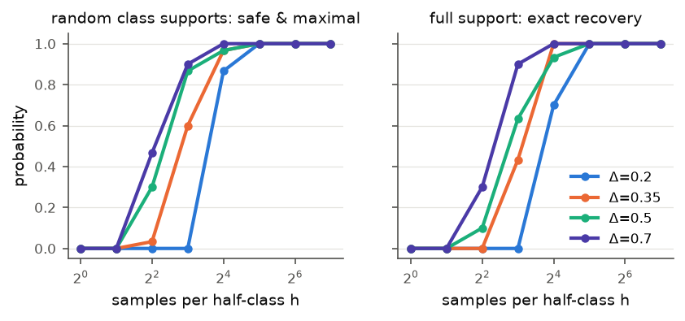
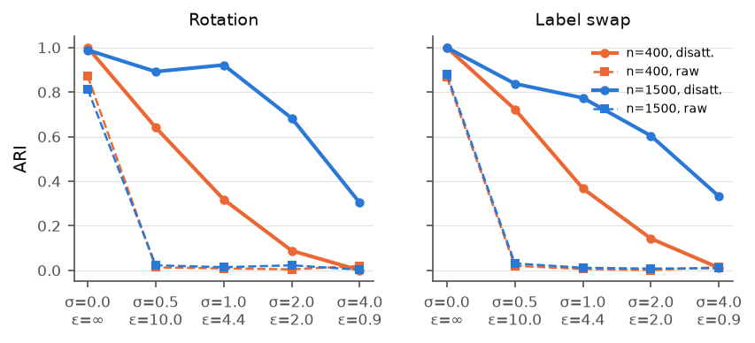
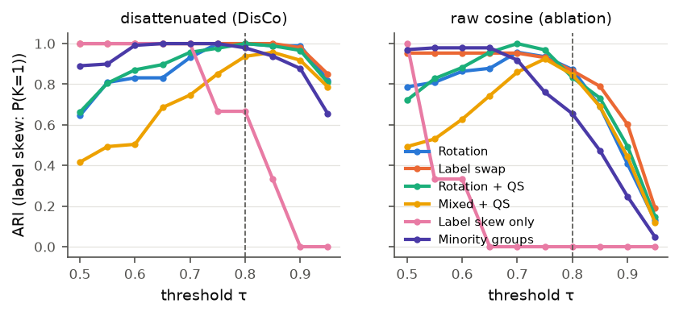

# DisCo-CFL: Disattenuated Class-Conditional Clustered Federated Learning

DisCo-CFL is a clustered federated learning (CFL) algorithm. It groups clients by
**concept** (the class-conditional distribution P(X | Y)), not by label distribution or
dataset size. It determines the number of clusters automatically with one threshold on a
**calibrated** similarity scale, and it comes with provable guarantees and with fairness,
accountability, transparency and privacy properties that go beyond accuracy.

The design targets open problems identified in *A Survey on Clustered Federated Learning:
Taxonomy, Analysis and Applications* (Ben Ali et al., ACM Computing Surveys 58(16), 2026):
unstable high-dimensional clustering features, grouping by label similarity, automatic
choice of K, quantity skew, privacy of the clustering step, and evaluation that looks only
at performance.

## Key idea

At a frozen reference model `w` (after a short FedAvg warm-up), each client uploads **once**,
for every class `c` it holds, the count-sketched mean gradient of the loss on **two random
halves** of its class-`c` samples: `(a_c, b_c)`, each of dimension `p = 1024`.

* The expected class-conditional gradient `mu_c = E[grad l(w; x, c) | x ~ P_i(X | Y=c)]`
  depends on a client **only through P_i(X | Y=c)**. It is therefore exactly invariant to
  label skew and quantity skew, and it changes under concept shift on features (e.g.
  rotation) and on targets (e.g. label swap).
* Estimated signatures are noisy, and noise *attenuates* cosine similarities. The two halves
  give the reliability `R_c = 2 r_c / (1 + r_c)` with `r_c = cos(a_c, b_c)`
  (Spearman–Brown). **Spearman's correction for attenuation** then gives the calibrated
  similarity

  `rho_ij^c = cos(m_i^c, m_j^c) / sqrt(R_i^c R_j^c)`,   with `m = (a + b) / 2`.

  This is a consistent estimator of the population cosine, so `1` means "same concept" for
  every client, whatever its sample size or DP noise level.
* Clustering uses agglomerative merging with a **class-wise bottleneck (min) linkage**,
  because two groups share a concept only if *every* class agrees. Merges are ordered by
  evidence and stop at a fixed threshold `tau = 0.8`. K is not an input.

## Properties beyond accuracy

| Property | What DisCo-CFL provides | Guarantee / measurement |
|---|---|---|
| **Fairness (group size)** | minority concept groups are not absorbed by large groups | recovery sample complexity independent of group size (Cor. 1); minority recall / purity, worst-group accuracy |
| **Fairness (data size)** | small clients are not split off by noise | disattenuation removes the sample-size bias (Thm. 1); low-evidence clients are attached, not isolated |
| **Transparency** | class-level explanation of why clusters differ, automatic heterogeneity diagnosis (feature shift vs. class-specific target shift vs. label/quantity skew only) | explanation fidelity (Prop. 3); precision/recall of the divergent classes |
| **Accountability** | per-client assignment certificate (similarity to own/closest cluster, standard errors, verdict), audit log of every merge, low-evidence and anomaly flags, newcomer and novel-concept detection | certificate calibration |
| **Privacy** | optional (ε, δ)-DP signatures (per-sample clipping + Gaussian noise); one-shot, low-dimensional upload | DP by the analytic Gaussian mechanism; the disattenuation stays consistent under DP noise (Prop. 2) |
| **Theory** | invariance, concentration, safety / maximality / exact recovery, minimax lower bound | Prop. 1–4, Thm. 1–3, Cor. 1 (proofs in `paper/`; deterministic core machine-checked in Lean 4, see `lean/`) |

## Theoretical results (summary)

* **Invariance.** `mu_i^c` depends only on `P_i(X | Y=c)`, so label skew and quantity skew
  leave the population similarity at exactly 1.
* **Concentration.** `|rho_hat − rho| ≤ C (sqrt(κ/r_s) + κ/sqrt(r_e)) sqrt(log(1/δ))`,
  where κ is the inverse SNR of a half-mean and r_s, r_e are effective ranks of the
  gradient noise. The raw cosine is biased by the factor `sqrt(R_i R_j)`.
* **Safety / maximality / exact recovery.** No two clients with conflicting concepts are
  ever merged. No two output clusters could be merged without mixing concepts. Under full
  class support the ground-truth partition is recovered and K̂ = K. Required samples per
  half-class: `h* = O(σ² log(N²C/δ) / (a r_s γ²))`, independent of cluster sizes.
* **Lower bound.** Any test needs `n ≥ σ² log(1/(4δ)) / (a r_s Δ)` samples. This matches
  the upper bound in σ², a and r_s, up to a factor 1/Δ and a log N term.
* **DP.** Signatures are (ε, δ)-DP. The required per-class sample size grows linearly in
  1/ε, while the raw cosine collapses under DP noise.

## Lean 4 verification

`lean/` is a Lean 4 + Mathlib project with 25 machine-checked theorems. It covers the deterministic
core of every result: population calibration, the linkage claims, safety for every merge order,
maximality, exact recovery, the corollary arithmetic, the lower-bound construction, DP
sensitivity, explanation fidelity and the Bayes optimality of prior correction. No theorem uses
`sorry`, and all depend only on Lean's standard axioms. See [`lean/README.md`](lean/README.md).

```bash
cd lean && lake exe cache get && lake build && lake env lean AxiomsCheck.lean
```

## Repository layout

```
discocfl/
  disco.py        # signatures, disattenuated similarity, clustering, certificates, explanations, DP, newcomers
  algorithms.py   # DisCo-CFL and baselines: FedAvg, Local, FedAvg-FT, IFCA, FeSEM, CFL/MTCFL, FL+HC, PACFL, Oracle
  data.py         # federated non-IID generation (MNIST, Fashion-MNIST, SVHN, CIFAR-10): rotations, label swaps,
                  # label skew, quantity skew, minority groups, K groups, partial participation
  fl.py           # model (small CNN) and FedAvg primitives
  synthetic.py    # synthetic signatures with known ground truth (tests, theory validation)
experiments/
  run.py              # accuracy benchmark (scenarios x methods x seeds)
  clustering_study.py # tau / DP / sample size / minority / explanations / certificates / newcomers / scalability
  theory_sim.py       # synthetic validation of the theorems
  summarize.py        # tables (results/tables) and figures (results/figures)
paper/            # LaTeX manuscript with full proofs (long version)
paper_tnnls/      # IEEE TNNLS version: main.pdf (8 pages) + supplement.pdf (full proofs, Lean, full tables)
                  #   submission/: single-file main.tex, figures, cover_letter.pdf
lean/             # Lean 4 formalization of the proofs
tests/            # unit tests
results/          # raw results, tables, figures
```

## Reproducing

```bash
pip install -r requirements.txt
export DISCO_DATA=/path/to/data          # MNIST/, FashionMNIST/ (raw idx files), cifar-10-python.tar.gz
python -m pytest -q tests
python experiments/theory_sim.py
python experiments/run.py --suite main --workers 4
python experiments/run.py --suite ablation --workers 4
python experiments/run.py --suite mnist --workers 4
python experiments/run.py --suite cifar --workers 4
for s in color newbase strength groups participation scale; do python experiments/run.py --suite $s --workers 4; done
python experiments/clustering_study.py --study all --workers 4
python experiments/summarize.py
cd paper && pdflatex main && bibtex main && pdflatex main && pdflatex main
```

## Results

All numbers: mean over 3 seeds (618 training runs in total), 40 clients unless stated, 50 rounds, same CNN and budget for every method.
"Acc" is mean local test accuracy with the Bayes prior correction applied **identically to every
method**. IFCA, FeSEM, FL+HC and PACFL are **given the true K**; DisCo-CFL finds K on its own.
Full tables: [`results/tables/main.md`](results/tables/main.md),
[`results/tables/studies.md`](results/tables/studies.md); manuscript: [`paper/main.pdf`](paper/main.pdf); IEEE TNNLS version: [`paper_tnnls/main.pdf`](paper_tnnls/main.pdf) and [`paper_tnnls/supplement.pdf`](paper_tnnls/supplement.pdf).

### Fashion-MNIST (main benchmark)

| Scenario | DisCo Acc | best baseline Acc | DisCo worst-group | best baseline worst-group | DisCo concept acc | best baseline concept acc | DisCo ARI / K | conflicting pairs merged (DisCo / baselines given K) |
|---|---|---|---|---|---|---|---|---|
| Rotation | **90.5** | 90.2 (CFL, 35 clusters) | **89.5** | 89.1 (CFL) | **83.9** | 80.6 (FeSEM) | 1.00 / 4 | 0% / 10–85% |
| Label swap | **90.8** | 90.6 (FedAvg-FT) | 89.2 | **89.7** (FedAvg-FT) | **84.9** | 80.9 (FedAvg-FT) | 1.00 / 4 | 0% / 6–86% |
| Rotation + quantity skew | **90.1** | 88.8 (CFL) | **88.7** | 86.7 (CFL) | **82.1** | 78.4 (FeSEM) | 1.00 / 4 | 0% / 12–85% |
| Mixed + quantity skew | **90.6** | 89.0 (IFCA) | **88.8** | 87.5 (IFCA) | **82.5** | 77.9 (FeSEM) | 0.94 / 4 | 0.6% / 8–85% |
| Label skew only (true K = 1) | **95.6** | 95.5 | **95.6** | 95.5 | 85.6 | **85.9** (FL+HC) | K = 1.3 | 0% |
| Minority groups (25/9/4/2) | **90.8** | 89.8 (FeSEM, PACFL) | **86.5** | 85.2 (Local) | **84.1** | 81.8 (FeSEM) | 0.98 / 4.3 | 0% / 6–75% |

DisCo-CFL matches the Oracle (clustering on the ground-truth groups) exactly in three scenarios
and is within 0.1 points in the others. On minority groups, its worst-group accuracy is 86.5%
against 35.7% for FedAvg, 51.9% for CFL, 67.3% for IFCA, 74.5% for FL+HC and 79.4% for FeSEM.

### Beyond accuracy

* Transparency. For label-swap groups, the divergent classes the server reports are
  *exactly* the swapped classes in 100% of cluster pairs, and the diagnosis ("class-specific
  concept shift") is always correct. For rotations, precision is 1.00 and recall 0.93; all
  misses are 0° vs. 180° pairs on items that are nearly invariant under 180° rotation.
* Accountability. 93–97% of clients receive a *confident* assignment certificate; these
  are 100% conflict-free on rotation and swap, and 91.9% (vs. 77.8% for *uncertain*
  certificates) in the hardest mixed scenario. Newcomers are assigned correctly in 96–100% of
  cases, and 100% of newcomers with an unseen concept are flagged as *novel*.
* Fairness. Minority groups of 1, 2, 3 and 5 clients are recovered with recall and purity
  1.00 and no conflicting merges. FL+HC merges 81% of the conflicting pairs, and PACFL misses
  the minority entirely.
* Privacy. With (ε, δ = 1e-5)-DP signatures, the raw cosine collapses to ARI ≈ 0 at every
  noise level, while DisCo-CFL degrades gracefully: with 1,500 samples per client, ARI is
  0.92 (rotation) and 0.77 (swap) at ε = 4.4, and 0.68 / 0.60 at ε = 2.
* Calibration. The same-group similarity is 0.98–0.99 for every client size from 50 to
  800 samples, and τ ∈ [0.75, 0.85] works in all concept-shift scenarios. λ has almost no
  effect between 0.02 and 1.
* Cost. One upload of about 1.2·10⁴ floats per client, independent of the model size;
  0.15 s per client to compute; 2.3 s of server time for 320 clients.





### Other datasets

| Dataset / scenario | DisCo Acc | best baseline Acc | DisCo concept acc | best baseline concept acc | DisCo ARI | Oracle Acc |
|---|---|---|---|---|---|---|
| MNIST rotation | **98.5** | 98.2 (FeSEM) | **97.1** | 95.9 (FeSEM) | 0.97 | 98.5 |
| MNIST label swap | **98.7** | 98.4 (FeSEM) | **97.8** | 97.1 (FeSEM) | 1.00 | 98.7 |
| SVHN rotation | **85.4** | 84.1 (FeSEM) | **79.7** | 75.6 (FeSEM) | 0.99 | 85.5 |
| SVHN label swap | **87.2** | 84.9 (FedAvg-FT) | **82.5** | 72.7 (FedAvg-FT) | 0.97 | 87.1 |
| CIFAR-10 rotation (warm-up 10 / 30) | 60.5 / 62.0 | **67.0** (CFL, 35 clusters) | 41.0 / **44.8** | 44.8 (FeSEM) | 0.38 / 0.74 | 64.2 |
| CIFAR-10 label swap (warm-up 10 / 30) | 64.1 / 64.6 | **68.8** (CFL, 33 clusters) | 48.6 / **49.8** | 43.7 (FeSEM) | 0.87 / 0.92 | 64.7 |

### Robustness sweeps (Fashion-MNIST)

| Factor | Setting | DisCo ARI / K | DisCo Acc | best baseline Acc | DisCo concept | best baseline concept | Oracle Acc |
|---|---|---|---|---|---|---|---|
| Shift strength | θ = 15° | 0.42 / 3.0 | 90.0 | **90.2** (FeSEM) | 82.8 | **83.0** (FeSEM) | 90.5 |
| Shift strength | θ = 30° | 0.93 / 4.3 | **90.3** | 90.0 (PACFL) | **83.1** | 81.2 (PACFL) | 90.4 |
| Shift strength | θ = 45° | 1.00 / 4.0 | **90.4** | 89.9 (FeSEM) | **83.8** | 81.8 (FeSEM) | 90.4 |
| Groups | K = 2 | 0.94 / 3.3 | **91.4** | 88.5 (IFCA) | **86.5** | 80.2 (IFCA) | 91.5 |
| Groups | K = 8 | 0.92 / 8.0 | **90.4** | 88.0 (FeSEM) | **81.7** | 75.4 (FeSEM) | 90.5 |
| Participation 30% | rotation | 1.00 / 4.0 | **89.1** | 87.5 (PACFL) | **78.4** | 75.1 (FeSEM) | 89.1 |
| Participation 30% | label swap | 0.98 / 4.0 | **89.3** | 86.5 (FeSEM) | **78.3** | 73.0 (FeSEM) | 89.3 |
| Scale | N = 200 | 0.98 / 6.3 | **91.1** | 89.8 (PACFL) | **86.6** | 83.9 (FeSEM) | 91.1 |

When the shift is too small to be told apart (15°), DisCo-CFL merges neighbouring concepts, as the
separation assumption predicts; this costs 0.5 points against the Oracle.

### Statistical significance

Paired one-sided Wilcoxon signed-rank tests over all (scenario, seed) pairs with concept shift show
that DisCo-CFL is significantly better than every baseline on mean, concept and worst-group
accuracy (all p < 0.01). Against the strongest baseline, FeSEM (given K), the win/tie/loss count is
45/4/8 on accuracy and 48/2/7 on concept accuracy
([`results/tables/signif_all.md`](results/tables/signif_all.md)).

### Ablation (Fashion-MNIST, ARI / K)

| Variant | Rotation | Label swap | Rot + QS | Mixed + QS | Label only |
|---|---|---|---|---|---|
| DisCo-CFL | 1.00 / 4.0 | 1.00 / 4.0 | 1.00 / 4.0 | 0.94 / 4.0 | K = 1.3 |
| without disattenuation | 0.87 / 6.7 | 0.87 / 6.0 | 0.83 / 7.0 | 0.85 / 5.7 | K = 4.0 |
| without class conditioning | 0.15 / 23.3 | 0.15 / 17.7 | 0.16 / 22.3 | 0.09 / 22.3 | K = 13.0 |
| mean instead of bottleneck linkage | 1.00 / 4.0 | 0.80 / 4.0 | 0.92 / 4.0 | 0.69 / 4.0 | K = 1.0 |
| without per-sample clipping | 0.94 / 5.0 | 1.00 / 4.0 | 0.91 / 5.7 | 0.88 / 5.3 | K = 3.0 |

### Limitations

* The class supports of each client are revealed to the server; DP protects records, not the label histogram.
* Signatures are only as informative as the reference model. On CIFAR-10 a 10-round warm-up
  gives weak separation (ARI 0.38). With 30 rounds, ARI reaches 0.74 and DisCo-CFL has the best
  concept accuracy, but CFL, which fragments the federation into 35 clusters, keeps the highest
  local accuracy.
* The theory assumes sub-Gaussian per-sample signatures (ensured by clipping) and does not cover
  the attachment heuristics; the upper bound exceeds the lower bound by a factor 1/Δ.
* Experiments use small CNNs and synthetic concept groups built from public image datasets.

